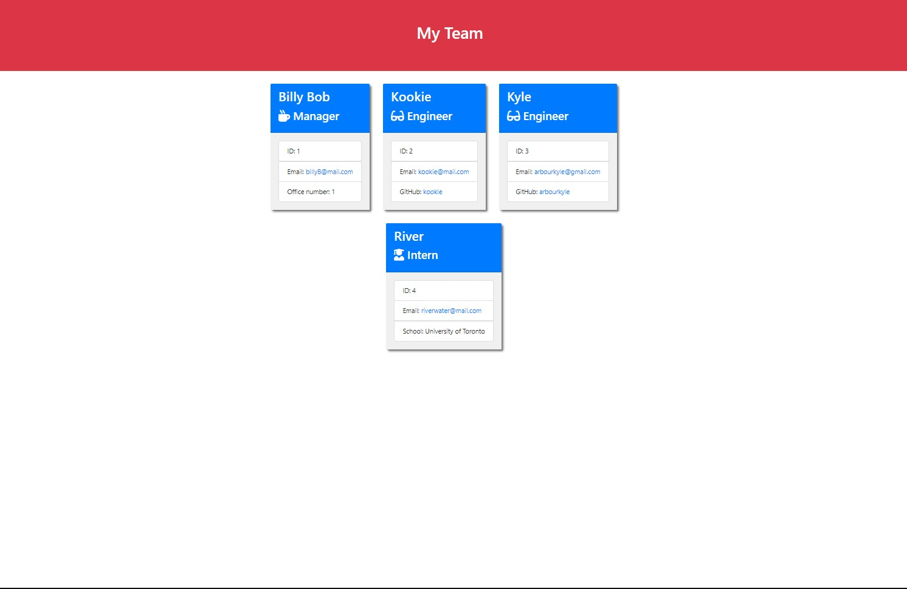

# Team Management Application

## Table of Contents

[Description](#description)

[Installation](#installation)

[Usage](#usage)

[License](#license)

[Contributing](#contributing)

[Tests](#tests)

[Questions](#questions)

## Description
This application generates a webpage with the information of your employees, team, and/or crew.

https://youtu.be/3mM4fuq22tA

## License
This product is under the The Unlicense.

## Installation
-Clone this repository 
-Open the repository folder in a terminal 
-With nodejs installed you can type  

  npm start

and follow the steps 
 -Add as many employees of as many types as you need to  and, when you are done, select generate and press enter.

## Usage
After you press generate, you can find a file called team-page in the dist folder, this is your webpage, right click and select open in default browser. For easy reference, you can move this file anywhere on your computer you like, make a desktop shortcut, or bookmark it in your browser.

## Contributing
Feel free to fork this project and make changes for review.

## Tests
Type npm run test 'filename' in the root folder. You can find the file names in the test folder. You must have nodejs and jest installed beforehand.

## Questions
https://github.com/arbourkyle 

Reach me at: arbourkyle@gmail.com
